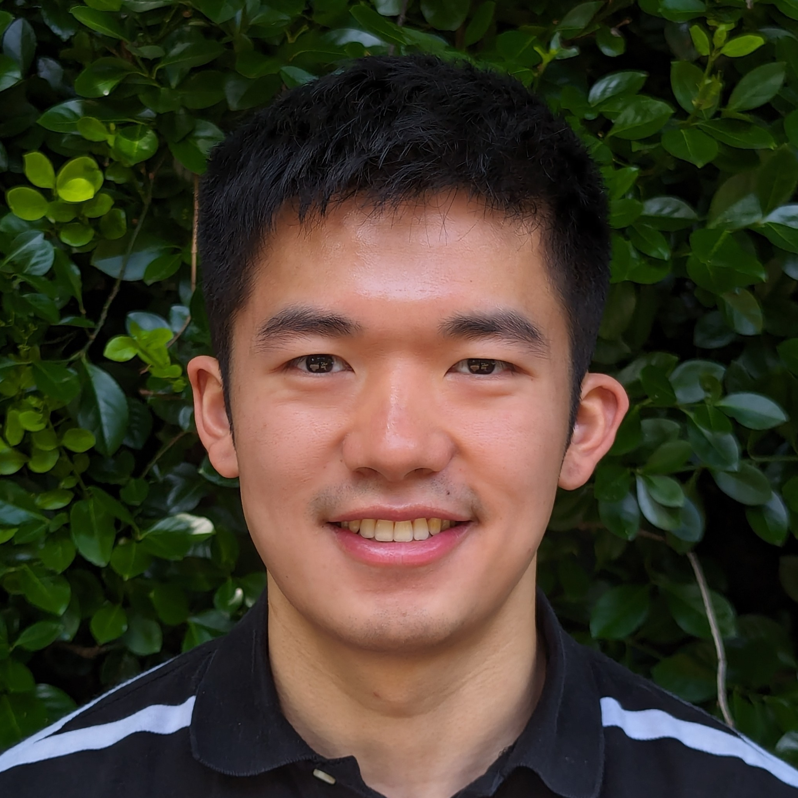
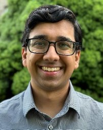

# ACT: Architectural Carbon Modeling Tool

## Abstract
**Motivation:** Over the past two decades, the world has witnessed a dramatic rise in computing across data centers, mobile, and communication technologies. As of 2015 information computing technology (ICT) accounts for up to 3% of global carbon emissions. Unfortunately, as the demand for computing grows with new applications and platforms so will its energy demand. Many technology companies, including Microsoft, Google, Facebook, and Amazon, have pledged to reduce their carbon footprints over the next decade. Meeting these pledges and enabling sustainable computing requires immediate action from the systems and architecture community.

**Background:** In addition to its importance, enabling environmentally sustainable computing introduces unique challenges to system and hardware design. First, carbon emissions are shifting from being dominated by operational energy consumption to hardware manufacturing. Traditionally the majority of emissions owe to operational hardware use (i.e., energy consumption). However, given the energy efficiency optimizations and increasing fabrication complexity, the majority of carbon emissions have shifted to hardware manufacturing. Given these new challenges, enabling environmentally sustainable computing demands distinct solutions across the computing stack, hardware life cycles, and end-to-end systems.

**This tutorial:** A fundamental bottleneck to conducting sustainability aware hardware design space exploration and optimization is the lack of carbon accounting tools. To address this gap, here we propose a tutorial for ACT, the first-of-its-kind architectural carbon modeling tool. ACT enables computer architects to quantify the embodied carbon footprint of hardware during early design space exploration — allowing designers to consider carbon as a first-order optimization target alongside performance, power, and energy. In this tutorial, we aim to provide a holistic overview of the sustainability implications of modern computer systems at the datacenter and mobile scale (motivation for ACT), an overview of the proposed ACT methodology, hands on demonstration for how to use ACT, and hands on demonstration for how to extend ACT in new ways. We believe such a tutorial will build a strong foundation for researchers across computer architecture, circuits and VLSI, and systems, to incorporate carbon analyses in their research.

## This tutorial
The second `ACT` tutorial will be held at [MICRO 2024](https://www.microarch.org/micro57/) in Austin, TX and presented by Udit Gupta and Leo Han. Virtual speakers and attendees can join at this [Zoom link](https://cornell.zoom.us/j/91412700463?pwd=GHQT1iD6PJFdwyXuJDzNtuDp5W8Apz.1)

| Time          | Topic                                                                            | Speaker                                   | Link                                                                                                                                                                                                                             |
| ------------- | :-------------:                                                                  | :--------:                                | :-------:                                                                                                                                                                                                                        |
| 1:00 - 1:15pm | Introduction to `ACT`                                                            | Udit Gupta (Cornell Tech)                 | [PPTX](https://github.com/S4AI-CornellTech/ACT/blob/main/tutorial/slides/pptx/ACT_MICRO_motivation_intro.pptx) [PDF](https://github.com/S4AI-CornellTech/ACT/blob/main/tutorial/slides/pdf/ACT_MICRO_motivation_intro.pdf)       |
| 1:15 - 1:30pm | Sustainable Computing: Motivation and Challenges                                 | Udit Gupta (Cornell Tech)                 | [PPTX](https://github.com/S4AI-CornellTech/ACT/blob/main/tutorial/slides/pptx/ACT_MICRO_motivation_tutorial.pptx) [PDF](https://github.com/S4AI-CornellTech/ACT/blob/main/tutorial/slides/pdf/ACT_MICRO_motivation_tutorial.pdf) |
| 1:30 - 2:15pm | Overview of `ACT`: An Architectural Carbon Modeling Tool                         | Udit Gupta (Cornell Tech)                 | [PPTX](https://github.com/S4AI-CornellTech/ACT/blob/main/tutorial/slides/pptx/ACT_MICRO_model.pptx) [PDF](https://github.com/S4AI-CornellTech/ACT/blob/main/tutorial/slides/pdf/ACT_MICRO_model.pdf)                             |
| 2:15 - 2:45pm | **Demo**: How to use `ACT`                                                       | Leo Han    (Cornell Tech)                 | [PPTX](https://github.com/S4AI-CornellTech/ACT/blob/main/tutorial/slides/pptx/ACT_MICRO_hands_on.pptx) [PDF](https://github.com/S4AI-CornellTech/ACT/blob/main/tutorial/slides/pdf/ACT_MICRO_hands_on.pdf)                       |
| 2:45 - 3:00pm | **Demo**: How to extend `ACT`                                                    | Leo Han    (Cornell Tech)                 | [PPTX](https://github.com/S4AI-CornellTech/ACT/blob/main/tutorial/slides/pptx/ACT_MICRO_hands_on.pptx) [PDF](https://github.com/S4AI-CornellTech/ACT/blob/main/tutorial/slides/pdf/ACT_MICRO_hands_on.pdf)                       |
| 3:00 - 3:30pm | _Coffee Break_                                                                   |                                           |                                                                                                                                                                                                                                  |
| 3:30 - 3:40pm | Invited talks: Designing Cloud Servers for Lower Carbon                          | Jaylen Wang (Carnegie Melon University)   |                                                                                                                                                                                                                                  |
| 3:40 - 3:50pm | Invited talks: Extending ACT to evaluate HI and FPGA for Sustainable Computing   | Chetan Choppal (Arizona State University) |                                                                                                                                                                                                                                  |
| 3:50 - 4:00pm | Invited talks: Carbon-Efficient Optimization for Computing Systems               | Mariam Elgamal (Harvard University)       |                                                                                                                                                                                                                                  |
| 4:00 - 4:10pm | Invited talks: Silicon-Photonics for Sustainable AI                              | Farbin Fayza (Boston University)          |                                                                                                                                                                                                                                  |
| 4:10 - 4:20pm | Invited talks: Energy-/Carbon- Aware Evaluation of 3D IC Architectures with DCIM | Hyung Joon Byun (Cornell Tech)            |                                                                                                                                                                                                                                  |
| 4:30 - 5:00pm | Group discussion                                                                 |                                           |                                                                                                                                                                                                                                  |
| 5:00 - 5:05pm | Closing remarks                                                                  |                                           | [PPTX](https://github.com/S4AI-CornellTech/ACT/blob/main/tutorial/slides/pptx/ACT_MICRO_Conclusion.pptx) [PDF](https://github.com/S4AI-CornellTech/ACT/blob/main/tutorial/slides/pdf/ACT_MICRO_Conclusion.pdf)                   |


## Citation
If you use `ACT`, please cite us:

```
@inproceedings{gupta2022act,
  title={ACT: designing sustainable computer systems with an architectural carbon modeling tool},
  author={Gupta, Udit and Elgamal, Mariam and Hills, Gage and Wei, Gu-Yeon and Lee, Hsien-Hsin S and Brooks, David and Wu, Carole-Jean},
  booktitle={Proceedings of the 49th Annual International Symposium on Computer Architecture},
  pages={784--799},
  year={2022}
}
```

## Contact us
For any further questions please contact <lxh4@cornell.edu> or <ugupta@cornell.edu> .

## About us

|  |  Organizer |
| ------------- | :------------- |
|  | **Leo Han** (Cornell Tech) is a second-year PhD student at Cornell Tech, advised by Udit Gupta. His research interests are at the intersection of sustainability and computing: both improving the sustainability of computing and using computing for sustainability applications. His current research focuses on providing fair, detailed, and accurate carbon footprint estimates for cloud users.  |
|  | **Udit Gupta** (Cornell Tech) is an Assistant Professor in Electrical and Computer Engineering at Cornell Tech. His research spans across sustainable computing, computer architecture, systems, and machine learning. Generally, he is interested in discovering and demonstrating new ways to design systems and hardware to improve the performance, efficiency, and environmental sustainability of emerging applications. |
